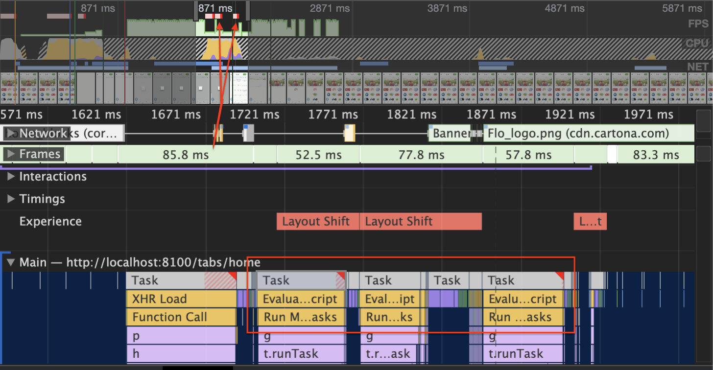

# Optimization Report

## Trial #1 (Minify Javascript Files)
___________

Description: On using Lighthouse tool to audit our application, it showed in the report that minifying javascript files can reduce payload and script parse time.

#### Steps:
- Set `optimization` flag in our `angular.json` file to true. This flag enables optimization of the build output. Including minification of scripts and styles, tree-shaking, dead-code elimination, inlining of critical CSS and fonts inlining.

#### Results:
- The Lighthouse audit report showed that the score increased by 15 points.

- The compiled code size reduced significantly from 32.5mb to 20.8mb. Using webpack bundle analyzer we saw that the javascript files generated sizes decreased.

Before Minification          |  AfterMinification
:-------------------------:|:-------------------------:
  |  

## Trial #2 (Remove unused CSS)

Description: Lighthouse report suggested that we can remove unused CSS, as it slows down the browser's construction of the render tree.

#### Steps:
- we checked the coverage tab in Chrome Dev Tools, and we noticed that `angular material` css was never used in our app, and we didn't need this package at all so we removed it.
- used `source-map-explorer` to see how much is the size of the package

- the `styles.js` file it's size significantly decreased from 108kb (~4500 lines) to 31kb (~1500 lines).

#### Results:
- The Lighthouse audit report didn't show much improvement in performance score, but the total blocking time has decreased by ~300ms and first contentful paint decreased by 200ms

## Trial #3 (Use onPush Strategy)
Description:
- We noticed when we started profiling the app performance using chrome dev tool that long tasks are triggered from Zone.js, after searching for the reason we realized that angular when a DOM event(click, hover, scroll, etc.) happen or async request occurs a change detection is triggered and it walks down starting from the root component and goes all the way down to check for changes.
- We can see here that there are two long tasks are triggered related to Zone.js 

#### Steps:
- use `onPush` change detection strategy to avoid unnecessary change detection for child components of the page.

#### Results:
- when we re-ran the performance profiling again we noticed that those Zone.js tasks are not triggered and the total scripting time has decreased by 300ms.

- The Lighthouse report didn't show much improvement in the performance score but some of the metrics gained better scoring like First Contentful Paint, Speed Index and Largest Contentful Paint

## Trial #4 (Dynamically Loading Scripts)
Description: We noticed in the Network tab that there are two scripts are fetched on app load and they increase the script evaluation time, and they're not loaded on app startup.

#### Steps:
- dynamically loading those scripts when needed to avoid unnecessary script evaluation.

#### Results:
- Lighthouse showed a big improvement in performance score

